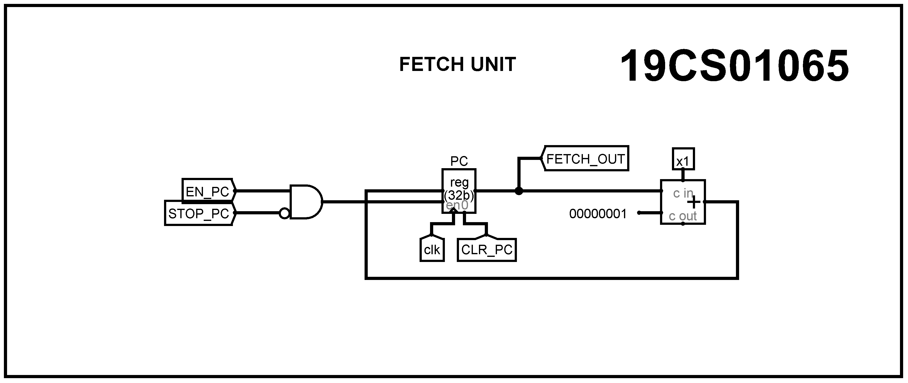
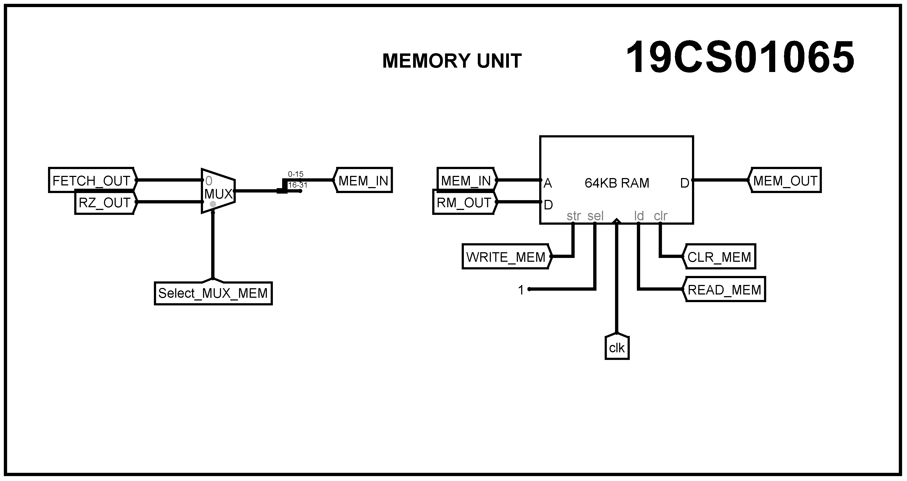
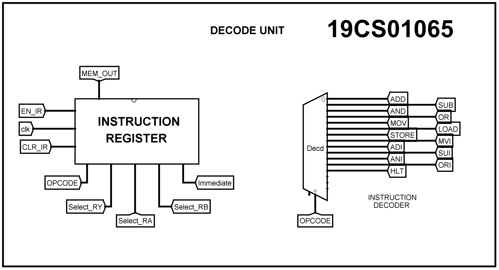
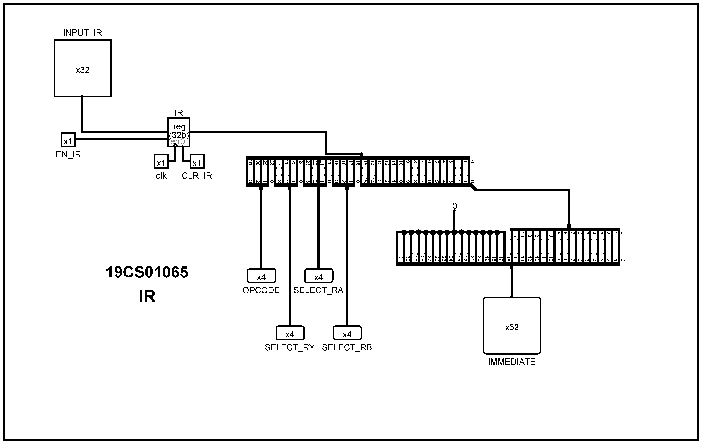
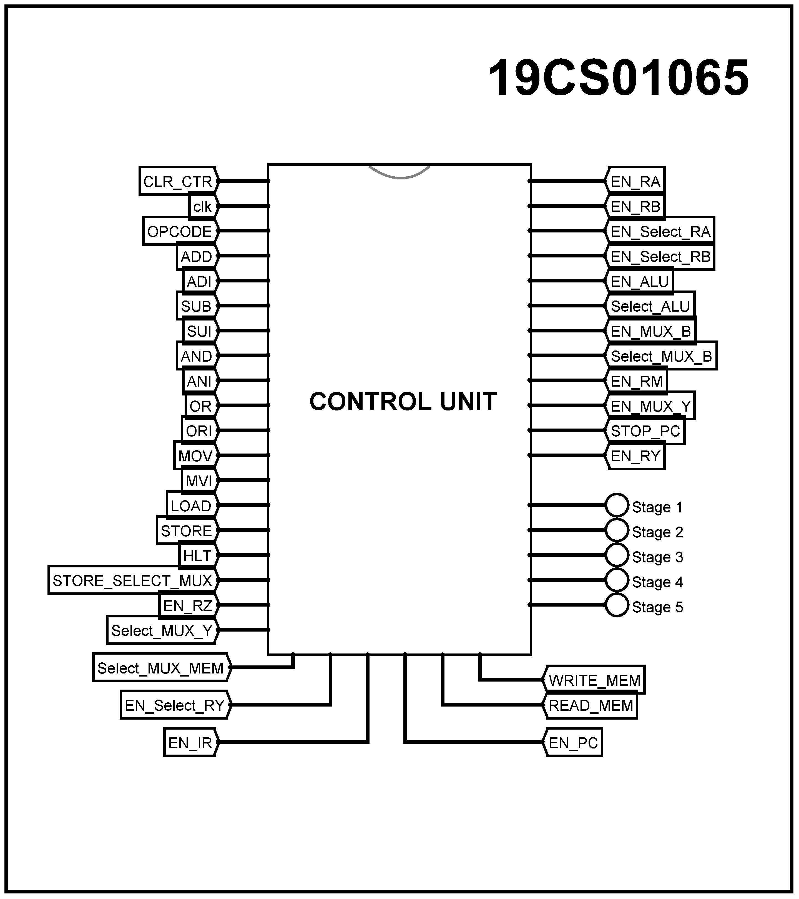
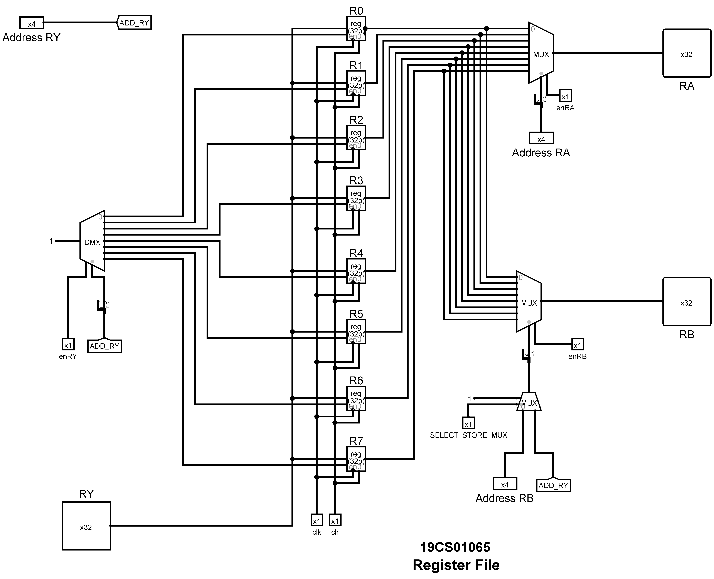
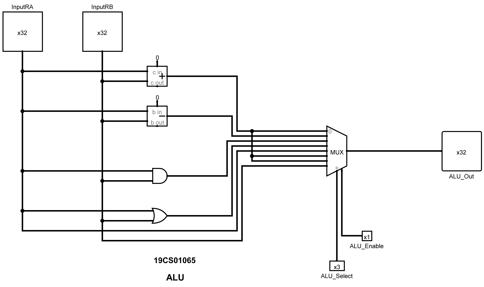

# 32-bit Processor Design
 
**Computer Organization and Architecture Laboratory | Autumn 2021 | Mini Project**
 
*Shrirang P. Deshmukh | 19CS01065*

## Contents

 1. [Problem Statement](#problem-statement)
 2. [Overall Architecture](#overall-architecture)
 3. [Components](#components)
 4. [Instruction Encoding](#instruction-encoding)
 5. [Control Signals](#control-signals)
 6. [Program Conversion Examples](#program-conversion-examples)
 

## Problem Statement

Designing of a 32-bit RISC processor that will support the following assembly instructions:

- **MOVE Ri, Rj** :  The content of Rj is transferred to Ri.

- **MOVE Ri, Immediate (16-bit)** :  The immediate value (32-bit unsigned extended) will be transferred to Ri.

- **LOAD Ri, X (Rj)** :  The content of memory location [[Rj] + X] is loaded into Ri, where X is a 16-bit unsigned immediate value.

- **STORE Ri, X (Rj)** :  The content of register Ri is stored in memory [[Rj] + X], where X is a 16-bit unsigned immediate value.

- **ADD Ri, Rj, Rk** :  Ri = Rj + Rk.

- **ADI Ri, Rj, Immediate (16-bit)** :  Ri = Rj + Immediate Value (32-bit unsigned extended)

- **SUB Ri, Rj, Rk** :  Ri = Rj - **Rk

- **SUI Ri, Rj, Immediate (16-bit)** :  Ri = Rj - **Immediate Value (32-bit unsigned extended)

- **AND Ri, Rj, Rk** :  Ri = Rj AND Rk.

- **ANI Ri, Rj, Immediate (16-bit)** :  Ri = Rj AND Immediate Value (32-bit unsigned extended)

- **OR Ri, Rj, Rk** :  Ri = Rj OR Rk.

- **ORI Ri, Rj, Immediate (16-bit)** :  Ri = Rj OR Immediate Value (32-bit unsigned extended)

- **HLT** : Stops the execution.

## Overall Architecture

| Components | Description | 
| :---        |    :----   | 
|General Purpose Registers (GPRs)|8  *R0 - R7*|
|Special Purpose Registers (SPRs)|7: *PC, IR, RA, RB, RM, RZ, RY*  | 
|Memory|RAM *16- bit Address Line and 32-bit Data*|
|Instruction Supported|13|

## Components 

### 1. **Processor Pipeline**

### 2. **Fetch Unit**

- A 32-bit register called as the Program Counter. PC has the address of memory location which has the next instruction.
- An adder to increment the value of PC by 1, to get to the next instruction address.

### 3. **Memory Unit**

- 16 (Address-line) X 32 (Data-bit) RAM, to store instructions and data.
- A 1-bit select multiplexer, Memory MUX which chooses the input address to the memory (i.e. either from the ALU or PC), the MUX is always enabled it shifts to ALU input only when Select is set to 1.

### 4. **Decode Unit**

- Instruction Register which stores the instruction received from the memory and splits to various parts according to the encoding scheme.
- Opcode Decoder for selecting the instruction based on Opcode from the instruction.

#### **Instruction Register ( Internal Circuit )**

### 5. **Control Unit**

- Control Unit takes input from about clock and current instruction and depending upon current stage, it gives appropriate control signals to other units.
- Stages are managed using a counter, which goes from 0 to 4 in round robin manner.
- Control Signals are paired with the required stages for each instruction using OR and AND gates.
- Control Signals include various Selects and Enables in Multiplexers, Enables in Registers and some STOP instructions.

#### **Control Unit (Internal Circuit)**

### 6. **Register File (Internal Circuit)**

- Register File has two multiplexers for send required data to two SPRs RA and RB each, and one demultiplexer for writing back data to the required register.
- One MUX k/as STORE MUX to handle the special case for STORE operation.

### 7. **ALU (Internal Circuit)**

- ALU supports four arithmetic operations for 32-bit numbers addition, subtraction, bitwise AND and bitwise OR.
- ALU supports passing one of the values directly to the output without any operation in case of MOVE and MVI instructions.
- The output is decided by using a multiplexer.

## Instruction Encoding

### Instruction Format

**32-bit Instruction | Supports 16-bit Immediate Value**

**Encoding:** OOOO YYYY AAAA BBBB XXXXXXXXXXXXXXXX

| **Component** | **Binary** | **Hexadecimal** |
| :--- | :--- | :--- |
| OPCODE | OOOO | O |
| DESTINATION (RY) | YYYYY | Y |
| SOURCE 1 | AAAA | A |
| SOURCE 2 | BBBB | B |
| IMMEDIATE | XXXXXXXXXXXXXXXX | XXXX |

### Encoding for Registers

4 bits are used for 8 registers, for ease in the hexadecimal encoding in Logisim as well as easy extension to 16 registers when required.

| **Register** | **Binary   Encoding** | **Hexadecimal   Encoding** |
| :--- | :--- | :--- |
| R0 | 0000 | 0 |
| R1 | 0001 | 1 |
| R2 | 0010 | 2 |
| R3 | 0011 | 3 |
| R4 | 0100 | 4 |
| R5 | 0101 | 5 |
| R6 | 0110 | 6 |
| R7 | 0111 | 7 |

### Opcode for Instructions

| OPCODE | Hexadecimal   OPCODE | Instruction |
| --- | --- | --- |
| 0000 | 0 | ADD Ri, Rj, Rk |
| 0001 | 1 | SUB Ri, Rj, Rk |
| 0010 | 2 | AND Ri, Rj, Rk |
| 0011 | 3 | OR Ri, Rj, Rk |
| 0100 | 4 | MOV Ri, Rj |
| 0101 | 5 | LOAD Ri, Rj, X |
| 0110 | 6 | STORE Ri, Rj, X |
| 0111 | 7 | MVI Ri, X |
| 1000 | 8 | ADI Ri, X |
| 1001 | 9 | SUI Ri, X |
| 1010 | A | ANI Ri, X |
| 1011 | B | ORI Ri, X |
| 1100 | C | HLT |

### Examples

#### **ADD R1, R2, R2 : 01220000**

| OPCODE | DEST | SRC1 | SRC2 | IMMEDIATE |
| --- | --- | --- | --- | --- |
| 0000 | 0001 | 0002 | 0002 | 0000000000000000 |
| 0 | 1 | 2 | 2 | 0000 |

No immediate Value in this case, keeping it 0 is preferable.
 Similar encoding needs to be followed in case of **SUB**, **AND** and **OR** instructions with respective opcodes.

#### **SUI R1, R2, 200 : 912000C8**

| OPCODE | DEST | SRC1 | SRC2 | IMMEDIATE |
| --- | --- | --- | --- | --- |
| 1001 | 0001 | 0010 | 0000 | 0000000011001000 |
| 9 | 1 | 2 | 0 | 00C8 |

No Source 2 value in this case, keep the value of source 2 as 0.
 Similar encoding needs to be followed in case of **ANI**, **ADI** and **ORI** instructions with respective opcodes.

#### **MOV R2, R6 : 42600000**

| OPCODE | DEST | SRC1 | SRC2 | IMMEDIATE |
| --- | --- | --- | --- | --- |
| 0100 | 0010 | 0110 | 0000 | 0000000000000000 |
| 4 | 2 | 6 | 0 | 0000 |

No Source 2 and Immediate value in this case, keep the value of source 2 &amp; immediate as 0.

#### **MVI R2, 240 : 720000F0**

| OPCODE | DEST | SRC1 | SRC2 | IMMEDIATE |
| --- | --- | --- | --- | --- |
| 0111 | 0010 | 0000 | 0000 | 0000000011110000 |
| 7 | 2 | 0 | 0 | 00F0 |

No Source 1 and Source 2 in this case, keep the value of source 1 and source 2 and immediate as 0.

#### **HLT : C0000000**

| OPCODE | DEST | SRC1 | SRC2 | IMMEDIATE |
| --- | --- | --- | --- | --- |
| 1100 | 0000 | 0000 | 0000 | 0000000000000000 |
| C | 0 | 0 | 0 | 0000 |

No field in this case except for opcode, keep all the values expect opcode as 0.

#### **LOAD R1, R2, 12 : 5120000C**

| OPCODE | DEST | SRC1 | SRC2 | IMMEDIATE |
| --- | --- | --- | --- | --- |
| 0101 | 0001 | 0010 | 0000 | 0000000000001100 |
| 5 | 1 | 2 | 0 | 000C |

No Source 2 value in this case, keep the value of source 2 as 0.

#### **STORE R3, R4, 20 : 63400014**

| OPCODE | DEST | SRC1 | SRC2 | IMMEDIATE |
| --- | --- | --- | --- | --- |
| 0110 | 0011 | 0100 | 0000 | 0000000000010100 |
| 6 | 3 | 4 | 0 | 0014 |

No Source 2 value in this case, keep the value of source 2 as 0.

Destination is not the destination in this case, its is actually the source, the encoding is just to follow the pattern till now.

** Note** 
1. In case of LOAD and STORE operations, the address is being calculated with R2 + X.
2. The address line is of 16-bits only, proper inputs should be given to make sure that the output does not exceeds 16-bits.

## Control Signals

The Processor follows a typical 5-stage pipeline with Fetch, Decode, Execute, Memory, and Write Back stages.

|     INSTRCTION                                                                          	|     STAGE 1                                                                                                                                   	|     STAGE 2                                                                                                                                	|     STAGE 3                                                                                                                                                                                                             	|     STAGE 4                                                                                                                        	|     STAGE 5                           	|
|--------------------------------------------------------------------------------------------	|--------------------------------------------------------------------------------------------------------------------------------------------------	|-----------------------------------------------------------------------------------------------------------------------------------------------	|----------------------------------------------------------------------------------------------------------------------------------------------------------------------------------------------------------------------------	|---------------------------------------------------------------------------------------------------------------------------------------	|------------------------------------------	|
|                                                                                            	|                                                                                                                                                  	|                                                                                                                                               	|                                                                                                                                                                                                                            	|                                                                                                                                       	|                                          	|
|     ADD R1,R2,R3     SUB R1,R2,R3     AND R1,R2,R3     OR R1,R2,R3    	|     MEM_IN = FETCH_OUT   (SELECT_MUX_MEM = 0)     READ_MEM= 1     EN_IR = 1, INPUT_IR =   MEM_OUT     EN_PC, PC = PC + 1    	|     EN_RA_SELECT =1     EN_RB_SELECT = 1     EN_RA = 1, RA = R2     EN_RB = 1, RB = R3                                   	|     EN_MUX_B =1, SELECT_MUX_B   = 0     EN_ALU = 1     SELECT_ALU = (CODE   DERIVED FROM LAST 3 BITS OF OPCODE)     ALU_OUT = RA (OPERATION)   RB     EN_RZ =1                                  	|     EN_RY     EN_MUX_Y (SELECT_MUX_Y =   0)     RY = RZ                                                                	|     EN_SELECT_RY     R1 = RY    	|
|                                                                                            	|                                                                                                                                                  	|                                                                                                                                               	|                                                                                                                                                                                                                            	|                                                                                                                                       	|                                          	|
|     ADI R1,R2,X     SUI R1,R2,X     ANI R1,R2,X     ORI R1,R2,X       	|     MEM_IN = FETCH_OUT (SELECT_MUX_MEM   = 0)     READ_MEM= 1     EN_IR = 1, INPUT_IR =   MEM_OUT     EN_PC, PC = PC + 1    	|     EN_RA_SELECT =1     EN_RA = 1, RA = R2                                                                                           	|     EN_MUX_B =1, SELECT_MUX_B   = 1     EN_ALU = 1     SELECT_ALU = (CODE   DERIVED FROM LAST 3 BITS OF OPCODE)     ALU_OUT = RA (OPERATION)   IMMEDIATE (X)     EN_RZ =1                       	|     EN_RY     EN_MUX_Y (SELECT_MUX_Y =   0)     RY = RZ                                                                	|     EN_SELECT_RY     R1 = RY    	|
|                                                                                            	|                                                                                                                                                  	|                                                                                                                                               	|                                                                                                                                                                                                                            	|                                                                                                                                       	|                                          	|
|     HLT                                                                                 	|     NO ACTION                                                                                                                                 	|     STOP_PC = 1                                                                                                                            	|     NO ACTION                                                                                                                                                                                                           	|     NO ACTION                                                                                                                      	|     NO ACTION                         	|
|                                                                                            	|                                                                                                                                                  	|                                                                                                                                               	|                                                                                                                                                                                                                            	|                                                                                                                                       	|                                          	|
|     LOAD, R1, R2, X                                                                     	|     MEM_IN = FETCH_OUT   (SELECT_MUX_MEM = 0)     READ_MEM= 1     EN_IR = 1, INPUT_IR =   MEM_OUT     EN_PC, PC = PC + 1    	|     EN_RA_SELECT =1     EN_RA = 1, RA = R2                                                                                           	|     EN_MUX_B =1, SELECT_MUX_B   = 1     EN_ALU = 1     SELECT_ALU = (CODE   DERIVED FROM LAST 3 BITS OF OPCODE)     ALU_OUT = RA + IMMEDIATE   (X)     EN_RZ =1                                 	|     EN_MUX_Y, SELECT_MUX_Y =   1     MEM_IN = RZ_OUT   (SELECT_MUX_MEM = 1)     READ_MEM = 1     RY = MEM_OUT    	|     EN_SELECT_RY     R1 = RY    	|
|                                                                                            	|                                                                                                                                                  	|                                                                                                                                               	|                                                                                                                                                                                                                            	|                                                                                                                                       	|                                          	|
|     STORE R1, R2, X                                                                     	|     MEM_IN=FETCH_OUT   (SELECT_MUX_MEM = 0)     READ_MEM= 1     EN_IR = 1, INPUT_IR=   MEM_OUT     EN_PC, PC = PC + 1       	|     EN_RA_SELECT =1     EN_RB_SELECT = 1     EN_RA = 1, RA = R2     EN_RB = 1, RB = R1     STORE_SELECT_MUX = 1    	|     EN_MUX_B =1, SELECT_MUX_B   = 1     EN_ALU = 1     SELECT_ALU = (CODE   DERIVED FROM LAST 3 BITS OF OPCODE)     ALU_OUT = RA + IMMEDIATE   (X)     EN_RZ =1     EN_RM = 1, RM = RB    	|     MEM_IN = RZ_OUT   (SELECT_MUX_MEM = 1)     MEM_DATA = RM_OUT     WRITE_MEM = 1                                     	|     NO ACTION                         	|
|                                                                                            	|                                                                                                                                                  	|                                                                                                                                               	|                                                                                                                                                                                                                            	|                                                                                                                                       	|                                          	|
|     MOV R1, R2                                                                          	|     MEM_IN = FETCH_OUT   (SELECT_MUX_MEM = 0)     READ_MEM= 1     EN_IR = 1, INPUT_IR =   MEM_OUT     EN_PC, PC = PC + 1    	|     EN_RA_SELECT =1     EN_RA = 1, RA = R2                                                                                           	|     EN_ALU = 1     SELECT_ALU = (CODE   DERIVED FROM LAST 3 BITS OF OPCODE)     ALU_OUT = RA     EN_RZ =1     EN_MUX_B =1, SELECT_MUX_B   = 1                                                   	|     EN_RY     EN_MUX_Y (SELECT_MUX_Y =   0)     RY = RZ                                                                	|     EN_SELECT_RY     R1 = RY    	|
|                                                                                            	|                                                                                                                                                  	|                                                                                                                                               	|                                                                                                                                                                                                                            	|                                                                                                                                       	|                                          	|
|     MVI R1, X                                                                           	|     MEM_IN = FETCH_OUT   (SELECT_MUX_MEM = 0)     READ_MEM= 1     EN_IR = 1, INPUT_IR =   MEM_OUT     EN_PC, PC = PC + 1    	|     NO ACTION                                                                                                                              	|     EN_MUX_B =1, SELECT_MUX_B   = 1     EN_ALU = 1     SELECT_ALU = (CODE   DERIVED FROM LAST 3 BITS OF OPCODE)     ALU_OUT = IMMEDIATE (X)     EN_RZ =1                                        	|     EN_RY     EN_MUX_Y (SELECT_MUX_Y =   0)     RY = RZ                                                                	|     EN_SELECT_RY     R1 = RY    	|

## Program Conversion Examples

### **A = B + C – Immediate**

Assuming R2 has the base address, X = 10, Y = 11, Z = 12 and Immediate = 16

| **Address** | **Machine Code** | **Assembly Code** |
| --- | --- | --- |
| 0000 | Load R1, X(R2); Loads B | 5120000A |
| 0001 | Load R3, Y(R2); Loads C | 5320000B |
| 0002 | Add R1, R1, R3; Adds B+C | 01130000 |
| 0003 | Sui R1, R1, #Immediate; Subtracts Immediate from (B+C) | 91100010 |
| 0004 | Store R1, Z(R2); Stores result in A | 6120000C |
| 0005 | HLT; Halts execution | C0000000 |

### **A = (B OR C) AND Immediate**

Assuming R2 has the base address, X = 20, Y = 21, Z = 22 and Immediate = 30

| **Address** | **Machine Code** | **Assembly Code** |
| --- | --- | --- |
| 0000 | Load R1, X(R2); Loads B | 51200014 |
| 0001 | Move R3, R1; Moves R1 to R3 | 43100000 |
| 0002 | Loads R1, Y(R2); Loads C | 51200015 |
| 0003 | Move R4, R1; Moves R1 to R4 | 44100000 |
| 0004 | OR R1, R3, R4; Performs OR of R3 and R4 | 31340000 |
| 0005 | ANI R5, R1, #Immediate; Performs AND with Immediate | A510001E |
| 0006 | Store R5, Z(R2); Stores the result in A | 65200016 |
| 0007 | HLT; Halts execution | C0000000 |

## Usage Instructions

1. Clone this repository using
`git clone https://github.com/shrirangpdeshmukh/32-bit-processor-logisim.git` or downloading the zip-file.
1.	Convert the Assembly Code to Machine Code using the encoding format mentioned above.
2.	Open the processor.circ file in Logisim.
3.	Click on the RESET Button to clear any previous data in the processor.
4.	Input the machine code instructions into the memory unit present in the main file. Make sure that program starts from address 0000 and it ends with a HLT instruction.
5.	Feed the data (if any) in the memory, and registers (by going into RegisterFile) required for the program at required address locations and registers respectively.
6.	Enable the ticks in Logisim to run the machine program. The program finishes execution once it receives the HLT instruction.

**Note**: Make sure the instructions and data fed to the memory and registers is in the hexadecimal format.
